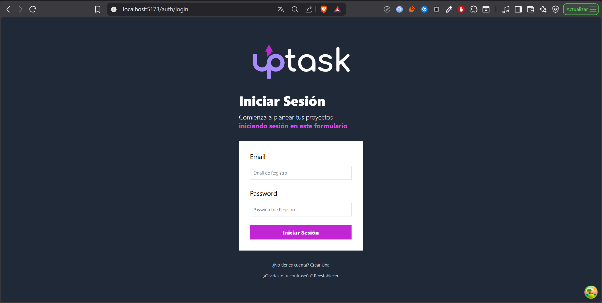
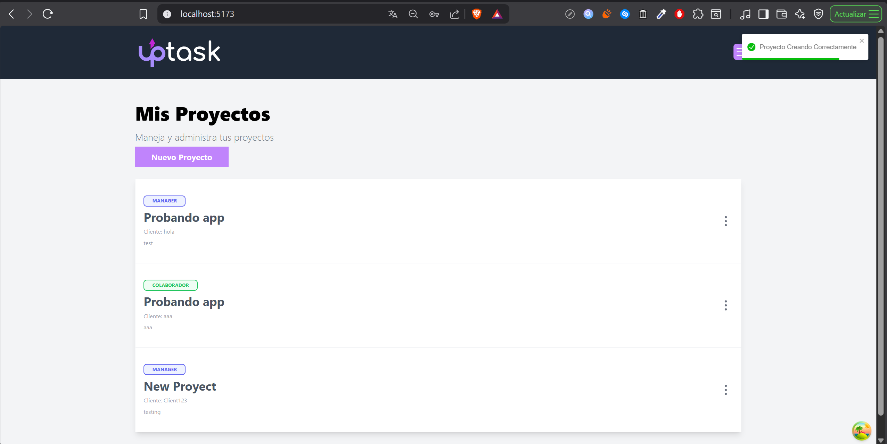
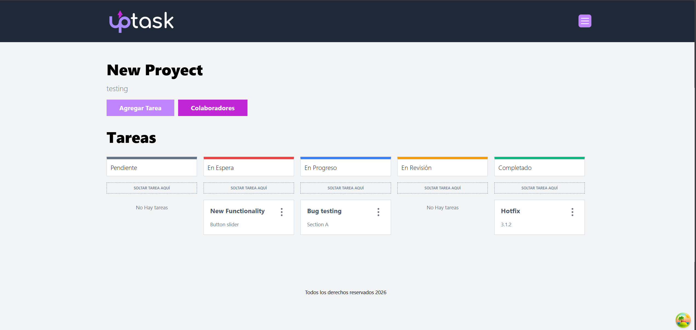
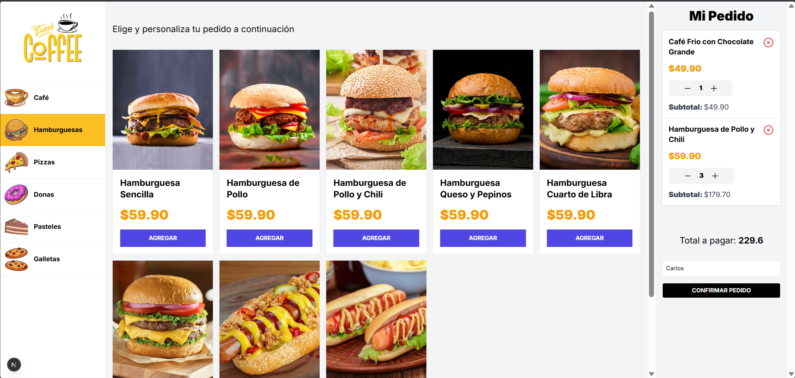
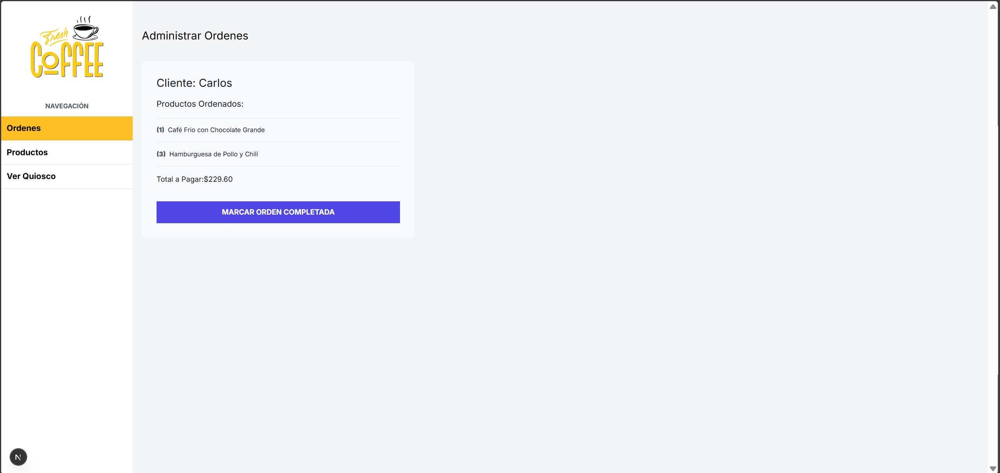
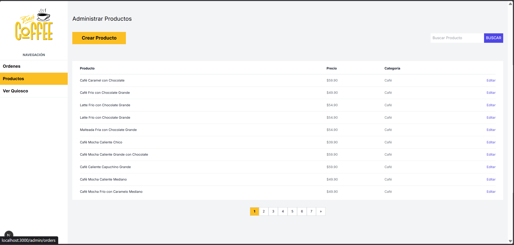

# React Course Showcase

## Index

1. [Introduction](#introduction)  
2. [Projects](#projects)   
5. [Screenshots](#screenshots)  

## Introduction

This repository contains two notable projects built while learning **React with TypeScript** in a hands-on Udemy course: [React from Beginner to Expert – Building 10+ Apps](https://www.udemy.com/course/react-de-principiante-a-experto-creando-mas-de-10-aplicaciones/).  

Both projects focus on practical skills: **Up Task**, a full-stack task manager, and **Kiosk**, a modern food ordering system built with Next.js.  

These apps showcase React fundamentals, state management, API usage, and real-world application architecture.

## Projects

### Up Task

- Full-stack task and project management system  
- Features authentication, role-based permissions, and a REST API  
- Users can create projects, manage tasks, and collaborate  

### Kiosk

- Full-stack food ordering application with multiple screens  
- Customer, kitchen, and admin dashboards with real-time updates  
- Includes product management, search, and paginated listings  
- Built using **Next.js App Router** with server-first architecture  

## Screenshots

  <!-- Up Task -->
  
  
  

  <!-- Kiosk -->
  
  
  

