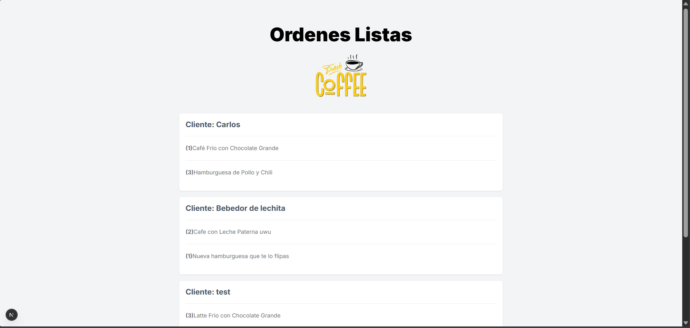

# Kiosk

## Index

1. [Introduction](#introduction)
2. [Features](#features)
3. [Tools & Technologies](#tools--technologies)
4. [Key Learning Outcomes](#key-learning-outcomes)
5. [Screenshots](#screenshots)

## Introduction

**Kiosk** is a full-stack application developed as part of an advanced **React & Next.js course**.  
This project serves as an introduction to **Next.js with the App Router**, focusing on modern full-stack patterns using server-first features.

The application simulates a real-world food ordering system with multiple synchronized screens: a customer-facing kiosk, a kitchen dashboard, and an order status display for the establishment. The main goal of this project was to understand how modern Next.js applications handle data, validation, and state across different environments.

## Features

- **Multi-Screen Order Flow**
  - Customer screen to create and place orders
  - Kitchen screen to receive and manage incoming orders
  - Establishment screen to notify customers when orders are ready

- **Complete CRUD Functionality**
  - Create, read, update, and delete products and orders
  - Real-time order status updates

- **Search & Pagination**
  - Product and order search
  - Paginated listings for better performance and usability

- **Modern Data Handling**
  - Server Actions for mutations
  - Schema validation to ensure data integrity
  - Global state management for UI and order flow

- **Clean & Responsive UI**
  - Optimized for kiosk-style usage
  - Fully responsive design with a modern look and feel

## Tools & Technologies

- **Next.js**
- **Server Actions**
- **Prisma**
- **Zod**
- **Zustand**
- **Tailwind CSS**
- **TypeScript**

## Key Learning Outcomes

- Learned the fundamentals of Next.js and server-first architecture.

## Screenshots

  

  

  

  

