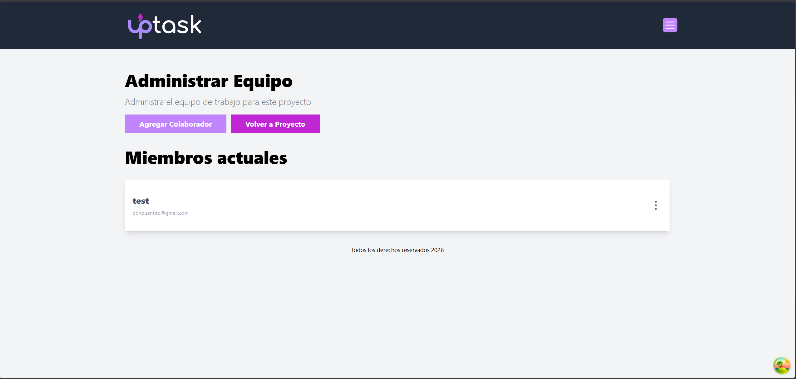
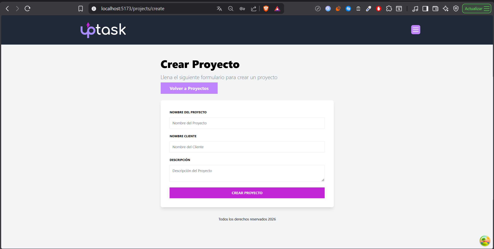
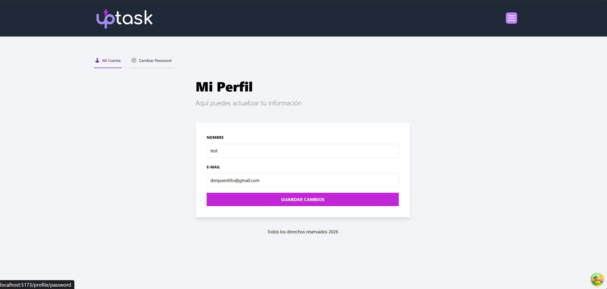
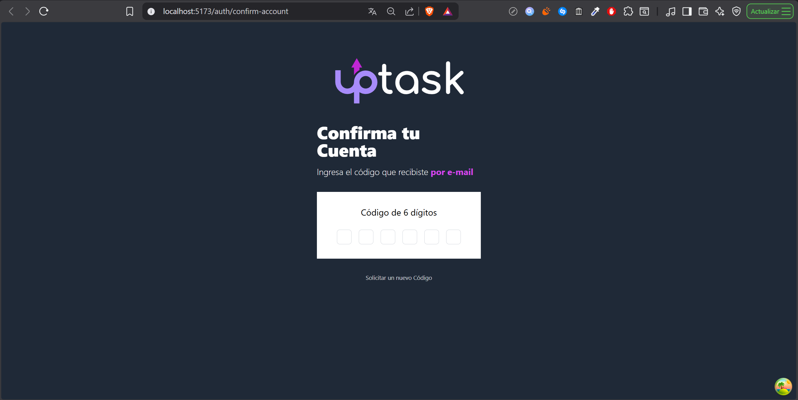
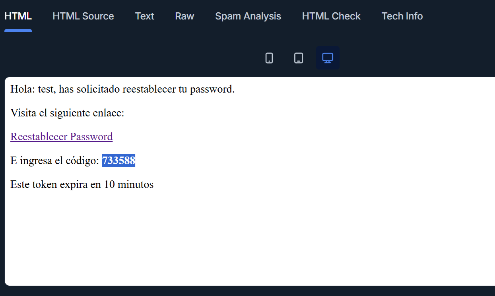

# Up Task

## Index

1. [Introduction](#introduction)
2. [Features](#features)
3. [Tools & Technologies](#tools--technologies)
4. [Key Learning Outcomes](#key-learning-outcomes)
5. [Screenshots](#screenshots)

## Introduction

**Up Task**  is a full-stack application developed as part of an advanced React & Next.js course.
This is the most complex project of the course and brings together modern frontend and backend technologies to build a real-world application.

The app allows users to manage projects and tasks with a robust authentication system, role-based permissions, and a fully featured REST API. The goal of this project was to gain hands-on experience building scalable applications using industry-standard tools and best practices.

## Features

- **User Authentication & Authorization**
  - User registration and login
  - Account confirmation via email
  - Password recovery and reset
  - Role-based access control

- **Project & Task Management**
  - Create, edit, and delete projects
  - Assign and manage tasks within projects
  - User-specific permissions for actions

- **Advanced REST API**
  - Secure endpoints
  - Token-based authentication with
  - Structured and scalable backend architecture

- **Modern Frontend Experience**
  - Fast data fetching and caching
  - Responsive and clean UI
  - Client-side routing and protected routes

## Tools & Technologies 

- **React**
- **React Router**
- **React Query**
- **Tailwind CSS**
- **Node.js**
- **Express** 
- **MongoDB**
- **TypeScript**
- **JWT**

## Key Learning Outcomes

- Built a complete full-stack application using the MERN stack.
- Implemented secure authentication flows and role-based permissions.
- Improved skills in state management, data fetching, and frontend architecture.

## Screenshots

  
  
  
  

  
  
  
  

